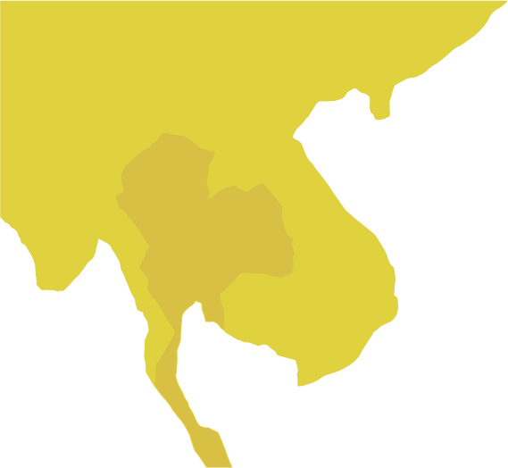

<?php
$top = file_get_contents('basic.php');
echo $top;
?>

印尼是全世界最大的群島國家,有「萬島之國」的稱號,較大的島嶼有爪哇島、蘇門答臘島、加里曼丹島、新幾內亞島以及蘇拉威西島。

<h4>人口</h4>

人口內容

<h4>信仰</h4>

信仰內容

<h4>天氣</h4>

天氣內容

<?php
$end = file_get_contents('end.php');
echo $end;
?>
